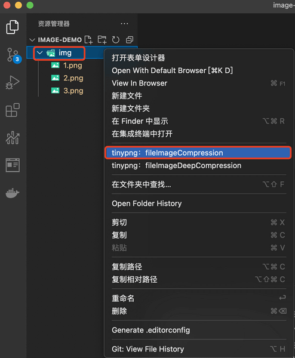
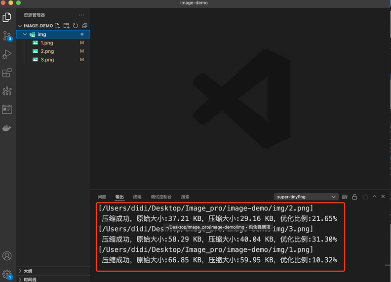
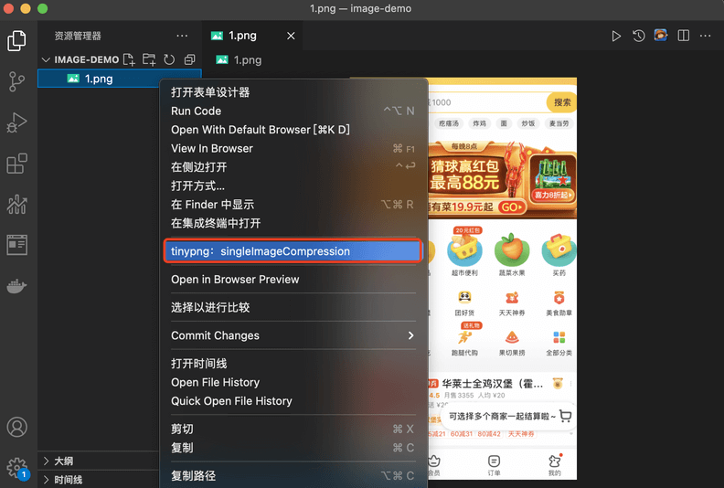
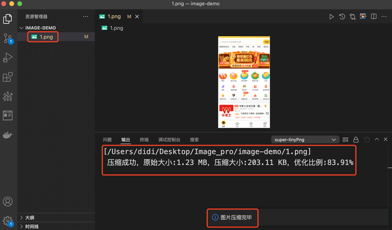
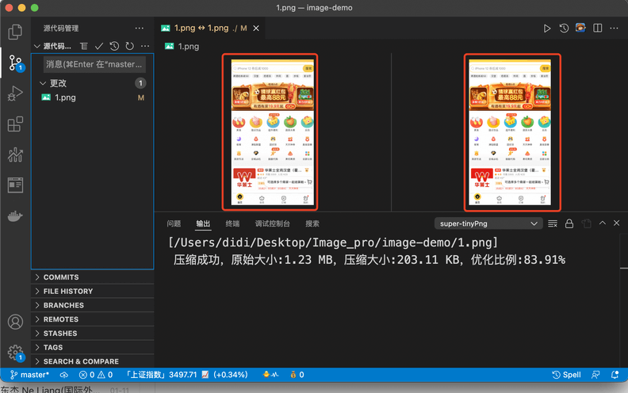

<!--
 * @Author: etwl
 * @Date: 2021-01-01 19:15:34
 * @LastEditTime: 2022-02-11 12:22:09
 * @LastEditors: Please set LastEditors
 * @Description: In User Settings Edit
 * @FilePath: /pw-super-tinypng/README.md
-->

## 使用方法

- 右键文件夹 执行  tinypng：fileImageCompression 进行文件内所有图片压缩（不支持文件夹递归压缩）
- 右键文件夹 执行  tinypng：fileImageDeepCompression 进行文件内所有图片压缩（压缩文件夹内所图片，包括文件夹内的所有文件夹）
- 右键文件 执行 tinypng：singleImageCompression 进行单个文件压缩

### tinypng：fileImageCompression

### tinypng：fileImageDeepCompression

### tinypng：singleImageCompression

## 支持压缩的图片类型

- png
- jpg
- jpeg
